# Military Exam

**সামরিক পরীক্ষা** — Bangladesh Armed Forces Examination System

A Flutter mobile app for secure, bring-your-own-device (BYOD) military examinations. Candidates take MCQ, fill-in-the-blank, and written exams on their personal phones under strict integrity controls: device binding, identity verification, runtime security monitoring, and automatic violation handling.

## Features

### Candidate flow
- Onboarding and candidate login with district selection
- Device binding and unbind from the candidate dashboard
- Identity verification via QR code scan
- Exam procedure timeline and pre-exam instructions
- Exam waiting room with countdown and roll number entry
- Submit review and finish-exam summary

### Exam types
- **MCQ** — multiple-choice questions with navigation and progress tracking
- **Fill-in-the-blank** — text input answers with local persistence
- **Written** — camera capture of handwritten answer sheets with document edge detection (no gallery uploads)

### Security and integrity
- **RASP** — root/jailbreak, hook, debugger, emulator, custom ROM, and untrusted install detection
- **Security gate** — pre-exam checks for airplane mode, Wi-Fi, developer mode, camera permission, and VPN lockdown
- **Exam watchdog** — continuous monitoring during active exam phases:
  - Airplane mode enforcement
  - Screenshot and screen-recording prevention
  - App lifecycle violations (backgrounding, switching apps)
  - Periodic device integrity re-checks
- **Violation handling** — automatic exam lock, penalty reporting, and forced submission on policy breach
- **Offline resilience** — answers cached locally (Hive) with recovery and pending image upload on submit

### Other
- Push-style notification history on the candidate dashboard
- Fully offline **demo mode** for development and QA without API calls
- Bengali UI copy with Hind Siliguri typography

## Tech stack

| Layer | Choices |
|-------|---------|
| Framework | Flutter (SDK ^3.11) |
| State / routing / DI | [GetX](https://pub.dev/packages/get) |
| Networking | [Dio](https://pub.dev/packages/dio) |
| Local storage | [Hive](https://pub.dev/packages/hive), [flutter_secure_storage](https://pub.dev/packages/flutter_secure_storage) |
| Security | [screen_security](https://pub.dev/packages/screen_security), custom `advanced_root_detection` and `flutter_edge_detection` packages |
| Scanning | [ai_barcode_scanner](https://pub.dev/packages/ai_barcode_scanner) |
| Logging | [logger](https://pub.dev/packages/logger) (debug only) |

## Architecture

Feature-first clean architecture with strict layer boundaries:

```
presentation  →  domain  →  data
 (UI, controllers)   (entities, usecases,   (models, datasources,
                      repositories)          repository impls)
```

- **Presentation** calls usecases; controllers hold UI state only.
- **Domain** defines entities and repository contracts; no Flutter or data-layer imports.
- **Data** models extend domain entities and add serialization (`fromJson` / `toJson`).
- Features are isolated — no cross-feature imports of `data/` or `presentation/`.
- Shared cross-feature types live under `lib/shared/`.

```
lib/
├── app/                  # App shell, routes, DI bindings
├── core/                 # Theme, network, services, widgets, config
├── features/             # auth, exam_session, mcq_exam, written_exam, …
├── shared/               # Cross-feature domain entities and enums
└── packages/             # Local plugins (root detection, edge detection)
```

## Prerequisites

- [Flutter SDK](https://docs.flutter.dev/get-started/install) compatible with Dart ^3.11
- Android Studio / Xcode for device builds
- **Android**: min SDK 29 (Android 10+)
- **iOS**: Xcode with CocoaPods (`cd ios && pod install`)

## Getting started

```bash
# Clone and install dependencies
git clone <repository-url>
cd military_exam
flutter pub get

# Run on a connected device or emulator
flutter run

# Run static analysis
flutter analyze

# Run unit and widget tests
flutter test
```

### Build modes

Build mode is resolved automatically from the Flutter build type:

| Flutter build | Build mode | Notes |
|---------------|------------|-------|
| `debug` | `development` | Network logs on, mock exam data allowed, relaxed simulator checks |
| `profile` | `staging` | Staging API, sideload allowed |
| `release` | `production` | Strict integrity, no network logs, sideload blocked |

Configuration lives in `lib/core/config/environment.dart` and `lib/core/config/deployment.dart`.

### Demo mode (offline)

Run without any API calls — all exam data is served from on-device storage:

```dart
// lib/main.dart
await DependencyRegistry.init(demo: true);
```

Or initialize deployment with `BuildMode.demo` before starting the app.

## Exam flow (high level)

```mermaid
flowchart LR
  A[Splash] --> B[Get Started]
  B --> C[Candidate Login]
  C --> D[Dashboard]
  D --> E[Exam Procedure]
  E --> F[Identity Verification]
  F --> G[Instructions]
  G --> H[Security Gate]
  H --> I[Batch Login]
  I --> J[Exam Waiting]
  J --> K[MCQ / Fill-blank / Written]
  K --> L[Submit Review]
  L --> M[Finish]
```



During active exam phases, `SecurityWatchdogService` enforces airplane mode, blocks screen capture, and watches for lifecycle violations. Any breach routes to the violation screen and triggers auto-submit.

## Local packages

| Package | Purpose |
|---------|---------|
| `packages/advanced_root_detection` | Native root/jailbreak, hook, and integrity checks |
| `packages/flutter_edge_detection` | Document scanning for written exam answer capture |

## Testing

The project includes unit tests for usecases, mappers, repositories, and security config, plus widget tests for exam layouts:

```bash
flutter test
flutter test test/unit/
flutter test test/widget/
```

## Code quality

- Follow `analysis_options.yaml` and `flutter_lints`
- Run `flutter analyze` before committing
- Use `logger` for debug logging — never `print` or expose raw errors in the UI
- Colors, assets, and typography are centralized in `lib/core/`

## License

Proprietary. All rights reserved unless otherwise stated by the project owner.
