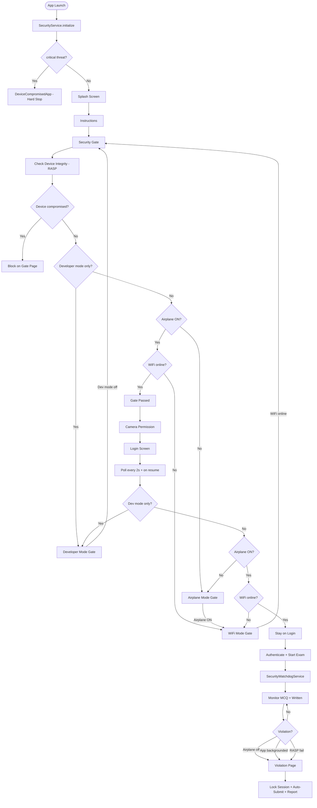

# Advanced Root Detection Implementation

**Military Exam Application — Security Architecture**

**Divergent Technologies Ltd**

Document version: 1.0  
Last updated: July 2026

---

## Table of Contents

1. [Executive Summary](#executive-summary)
2. [Architecture Overview](#architecture-overview)
3. [Advanced Root Detection Package](#advanced-root-detection-package)
4. [SecurityService (RASP Layer)](#securityservice-rasp-layer)
5. [Threat Categories and Detection](#threat-categories-and-detection)
6. [Blocking Scenarios](#blocking-scenarios)
7. [Pre-Exam Security Gate Flow](#pre-exam-security-gate-flow)
8. [Login Screen Monitoring](#login-screen-monitoring)
9. [Exam Watchdog (Runtime Protection)](#exam-watchdog-runtime-protection)
10. [Violation Handling](#violation-handling)
11. [Deployment and Environment Modes](#deployment-and-environment-modes)
12. [Release Hardening (ProGuard)](#release-hardening-proguard)
13. [Key Source Files](#key-source-files)
14. [Appendix: Full Security Flowchart](#appendix-full-security-flowchart)

---

## Executive Summary

The Military Exam application uses a layered security model built around **Divergent Technologies Ltd**'s local **`advanced_root_detection`** Flutter plugin. This plugin combines Kotlin/Java detectors, an isolated Android process, and a native NDK library (`libshield.so`) to detect root, hooking frameworks, debuggers, emulators, tampering, custom ROMs, and environment spoofing.

The app wraps the plugin in **`SecurityService`**, which applies deployment-aware blocking policy. Security is enforced at four lifecycle stages:

| Stage | Component | Purpose |
|-------|-----------|---------|
| Cold start | `main()` + `SecurityService.initialize()` | Hard block before UI if critical threat |
| Pre-exam | Security Gate + sub-gates | Device integrity, developer mode, airplane mode, WiFi |
| Login | `LoginController` polling | Continuous monitoring while credentials are entered |
| During exam | `SecurityWatchdogService` | Airplane mode, lifecycle, RASP recheck, screen capture block |

The design is **fail-closed**: platform errors and check failures are treated as unsafe posture.

---

## Architecture Overview

```
┌─────────────────────────────────────────────────────────────────┐
│                     Divergent Technologies Ltd                   │
│              Military Exam — Security Architecture               │
└─────────────────────────────────────────────────────────────────┘

  ┌──────────────────┐     ┌─────────────────────┐
  │ advanced_root_   │     │  libshield.so (NDK) │
  │ detection plugin │────▶│  Kotlin detectors   │
  │ (Flutter)        │     │  IsolatedRootService│
  └────────┬─────────┘     └─────────────────────┘
           │ ThreatReport
           ▼
  ┌──────────────────┐
  │ SecurityService  │◀── Deployment (prod/dev/demo)
  │ (RASP policy)    │
  └────────┬─────────┘
           │
     ┌─────┴─────┬──────────────┬─────────────────┐
     ▼           ▼              ▼                 ▼
  main()    Security Gate   LoginController   SecurityWatchdog
  (startup)  (pre-exam)      (2s polling)      (during exam)
```

---

## Advanced Root Detection Package

**Location:** `packages/advanced_root_detection/`  
**Dependency:** Local path in `pubspec.yaml`

### Dart API

| Method | Description |
|--------|-------------|
| `performCheck(SecurityConfig)` | Full multi-detector scan; returns `ThreatReport` |
| `verifyBeforeSensitiveOp(SecurityConfig)` | Fast native recheck before sensitive operations |
| `startMonitoring()` / `stopMonitoring()` | Background threat stream (available but not used by app) |
| `threatStream` | Broadcast stream of live threats |

The Military Exam app uses **`performCheck`** at initialization and gate checks, and **`verifyBeforeSensitiveOp`** during exam polling.

### Android Native Stack

| Layer | Path | Role |
|-------|------|------|
| Plugin | `AdvanceRootDetectionPlugin.kt` | Orchestrates all detectors via MethodChannel |
| Isolated process | `IsolatedRootService.kt` | Runs root/native checks outside app process (bypasses Magisk DenyList) |
| Kotlin detectors | `detectors/` | Root, Hook, Emulator, Debugger, Tampering, Environment, Spoofing, CustomRom, Bootloader |
| NDK | `cpp/` → `libshield.so` | Anti-debug, hook detection, Zygisk, proc scanning, integrity |

**Detector execution order:** Root → Hook → Emulator → Debugger → Tampering → Environment → Spoofing → CustomRom → BootloaderAttestation → NativeDetector → IsolatedRootService IPC.

### Native C++ Capabilities (`libshield.so`)

- TracerPid / debugger detection (`anti_debug.cpp`)
- `/proc/self/maps` hook and Frida mapping scan (`hook_detector.cpp`)
- Zygisk / Magisk module detection via `dl_iterate_phdr` (`zygisk_detector.cpp`)
- Shamiko hooked-I/O detection
- Inline libc hook detection
- Writable `.text` segment checks (`integrity_check.cpp`)
- Root artifacts via syscalls, privileged GIDs (`proc_scanner.cpp`)
- Overlay mount detection (`statfs`)
- Magisk property reads (`property_reader.cpp`)

### Kotlin RootDetector (OWASP MASTG / RootBeer style)

- `su` binary path checks
- Magisk / root manager package detection
- Dangerous system properties (`ro.debuggable`, `ro.secure`)
- Read-write paths on system partitions
- `which su` command execution
- Native root test bridge

---

## SecurityService (RASP Layer)

**File:** `lib/core/services/security_service.dart`

`SecurityService` is a singleton that wraps `AdvanceRootDetection` and maps raw `ThreatReport` data into app-level `SecurityStatus`.

### Core API

| Method | When used |
|--------|-----------|
| `initialize()` | App cold start in `main()` |
| `recheck()` | Security gate, login polling, integrity datasource |
| `verifyBeforeSensitiveOp()` | Exam watchdog 3-second poll |
| `lastStatus` | Cached result for developer-mode-only heuristics |

### SecurityStatus Flags

| Flag | Meaning |
|------|---------|
| `isRooted` | Android privileged access or custom ROM |
| `isJailbroken` | iOS privileged access |
| `isHooked` | Frida, Xposed, runtime manipulation |
| `isDebuggerAttached` | Active debugger |
| `isEmulator` | Analysis environment (blocked in production only) |
| `hasTestKeys` | Build signed with test-keys |
| `isIntegrityViolated` | APK tampering or integrity breach |
| `isUntrustedInstall` | Non-allowlisted installer (production) |
| `isEnvironmentSpoofed` | Device fingerprint spoofing |
| `isCustomRom` | Custom ROM indicators |
| `posture` | `safe`, `unsafe`, or `checkFailed` |

### Blocking Policy

**Always blocks (high/critical):**

- `integrityViolation`
- `privilegedAccess` (root/jailbreak)
- `runtimeManipulation` (hooks)
- `debuggerAttached` (except low-confidence heuristics)
- `untrustedSource` when sideload is disallowed

**Conditionally blocks:**

- `analysisEnvironment` (emulator) — only when `Deployment.isProduction`
- Bootloader / custom ROM / spoofing — when `strictExamIntegrity` is true
- Composite rule: ≥2 medium `privilegedAccess` threats with strict integrity

**Explicitly non-blocking (routed separately):**

- Developer options / USB debugging / ADB signals → Developer Mode gate
- Emulator in non-production builds
- Sideload when `allowSideload` is true

### Developer Mode Heuristics

Developer mode is detected from threat descriptions containing:

- `developer options`, `developer mode`, `development_settings`
- `usb debugging`, `adb enabled`, `adb_wifi`

Function `isDeveloperModeOnlyIssue()` returns true when developer mode is the **only** security concern (no root, spoof, ROM, or critical threats). This routes users to a remediation screen instead of a hard compromise block.

---

## Threat Categories and Detection

| ThreatCategory | Examples detected |
|----------------|-------------------|
| `privilegedAccess` | su binary, Magisk, Zygisk, Shamiko, root apps, overlay mounts |
| `runtimeManipulation` | Frida, Xposed, inline hooks, hooked `/proc` maps |
| `debuggerAttached` | TracerPid, ptrace, developer options signals |
| `analysisEnvironment` | Emulator fingerprints, Genymotion, AVD |
| `integrityViolation` | APK tampering, spoofing, writable code segments |
| `untrustedSource` | APK not from Google Play / allowlisted store |
| `screenCapture` | Package capability (defined; not wired to violations) |

### Severity Levels

`info` → `low` → `medium` → `high` → `critical`

Blocking thresholds depend on category and deployment flags. Critical threats at cold start prevent the app from launching entirely.

---

## Blocking Scenarios

| # | Scenario | Trigger | Action | Destination |
|---|----------|---------|--------|-------------|
| 1 | Critical RASP at startup | `main()` → `initialize()` | Hard stop — no navigation | `DeviceCompromisedApp` |
| 2 | Root / hook / debugger / ROM / spoof | Security Gate integrity check | Block continue button | Stay on `/security/gate` |
| 3 | Developer mode only | Gate or Login poll | Remediation screen | `/security/developer-mode` |
| 4 | Airplane mode off | Gate or Login poll | Remediation screen | `/security/airplane-mode` |
| 5 | WiFi offline (airplane on) | Gate or Login poll | Remediation screen | `/security/wifi-mode` |
| 6 | Camera permission denied | Post-gate | Remediation screen | `/security/camera-permission` |
| 7 | Airplane disabled during exam | Watchdog stream + poll | Violation — lock + auto-submit | `/violation` |
| 8 | App backgrounded / minimized | Watchdog lifecycle | Violation (1s grace) | `/violation` |
| 9 | RASP fails during exam | Watchdog poll | Violation as rooted device | `/violation` |
| 10 | WiFi flap during exam | Watchdog connectivity | UI alert only — no violation | Stay on exam |

---

## Pre-Exam Security Gate Flow

**Controller:** `SecurityGateController`  
**Route:** `/security/gate`

### Check Sequence

1. **Device integrity** (`CheckDeviceIntegrityUseCase` → RASP recheck)
   - Compromised → show compromised UI on gate page
   - Environment spoofed / custom ROM → compromised
   - Developer-mode-only → redirect to Developer Mode gate
2. **Airplane mode** — must be **ON**
   - Off → redirect to Airplane Mode gate
3. **Connectivity** — WiFi must be **online**
   - Offline → redirect to WiFi Mode gate
4. **Passed** → user continues to camera permission → login

### Sub-Gate Return Paths

| Gate | On success navigates to |
|------|-------------------------|
| Developer Mode | `/security/gate` |
| Airplane Mode | `/security/wifi-mode` |
| WiFi Mode | `/security/gate` |
| Camera Permission | `/login` |

### Security Checklist (8 items)

1. Device not rooted  
2. No hooking frameworks  
3. No debugger attached  
4. Not running on emulator (production)  
5. No test-keys signature  
6. Developer mode inactive  
7. Airplane mode active  
8. WiFi connected  

---

## Login Screen Monitoring

**Controller:** `LoginController`  
**Page:** `login_page.dart` (UI only — logic in controller)

While the examinee is on the login screen, security requirements are continuously verified:

| Mechanism | Interval / Trigger |
|-----------|-------------------|
| Periodic poll | Every **2 seconds** (`AppConstants.airplaneModePollInterval`) |
| App resume | **400 ms** delay after returning from Settings (`settingsReturnRecheckDelay`) |

### Verification Order

1. **Device integrity** → if developer-mode-only → redirect to Developer Mode gate  
2. **Airplane mode** → if off → redirect to Airplane Mode gate  
3. **Connectivity** → if offline (and airplane still on) → redirect to WiFi Mode gate  

Polling is **cancelled** when the examinee successfully enters the exam and the watchdog takes over.

This ensures that toggling developer options or airplane mode while on the login screen is detected within ~2 seconds or immediately on return from system Settings.

---

## Exam Watchdog (Runtime Protection)

**Service:** `SecurityWatchdogService`  
**Started:** After successful login via `StartSecurityWatchdogUseCase`

### SecurityPolicy Defaults

| Setting | Value |
|---------|-------|
| `requireAirplaneMode` | `true` |
| `monitorLifecycle` | `true` |
| `preventScreenCapture` | `true` |
| `monitoredPhases` | MCQ, Written |
| `pollInterval` | 3 seconds |
| `lifecycleViolationGracePeriod` | 1 second |

### Active Monitors (MCQ + Written phases only)

| Monitor | Violation |
|---------|-----------|
| Airplane mode stream + poll | `airplaneModeDisabled` |
| RASP `verifyBeforeSensitiveOp()` | `rootedDevice` |
| App paused (after grace) | `appBackgrounded` |
| App hidden (after grace) | `appMinimized` |
| Screen capture | Blocked via `ScreenSecurityService` |
| Connectivity changes | Alert only (no violation) |

**Camera capture exemption:** During document scanning in the written exam, lifecycle violations are suppressed via `setCameraCaptureActive(true)`.

---

## Violation Handling

**Pipeline:** `HandleSecurityViolationUseCase`

When a violation occurs during an active exam phase:

1. `ExamLockService.lock(reason)` — local lock
2. `ReportSecurityViolationUseCase` — server report + penalty evaluation
3. `AutoSubmitExamUseCase` — auto-submit if session exists
4. Navigate to `/violation` with violation details

### ViolationType Reference

| Type | Wired to watchdog | Lockable |
|------|-------------------|----------|
| `airplaneModeDisabled` | Yes | Yes |
| `appBackgrounded` | Yes | Yes |
| `appMinimized` | Yes | Yes |
| `rootedDevice` | Yes | Yes |
| `developerModeEnabled` | Pre-exam only | Yes |
| `jailbreakDetected` | Pre-exam only | Yes |
| `wifiDisabledDuringExam` | No (enum only) | — |
| `screenshotTaken` | No | Yes (penalty ready) |
| `screenRecordingDetected` | No | Yes (penalty ready) |

---

## Deployment and Environment Modes

**Files:** `lib/core/config/deployment.dart`, `environment.dart`, `build_mode.dart`

| Flag | Development | Staging | Production | Demo |
|------|-------------|---------|------------|------|
| `allowSideload` | true | true | **false** | true |
| `strictExamIntegrity` | true | true | true | true |
| `blockEmulator` | false | false | **true** | false |
| Network API | staging | staging | production | none (offline) |

### Security-Relevant Getters

- **`allowSideload`** — skips untrusted-source blocking when true  
- **`strictExamIntegrity`** — enables bootloader, custom ROM, spoofing blocks  
- **`isProduction`** — blocks emulators in RASP policy  

> **Note:** `main.dart` currently initializes with `Deployment.init(demo: true)`. For production RASP posture (no sideload, emulator block), use `Deployment.init()` without the demo flag.

---

## Release Hardening (ProGuard)

**File:** `android/app/proguard-rules.pro`

Release builds enable minification and resource shrinking in `android/app/build.gradle.kts`.

ProGuard rules preserve:

- Flutter engine classes
- `com.advanced_root_detection.**` plugin classes
- `AdvanceRootDetectionPlugin`
- JNI native method names (required for `libshield.so` bridge)

This prevents R8 from stripping security-critical native bindings in release APKs.

---

## Key Source Files

| Area | Path |
|------|------|
| RASP singleton | `lib/core/services/security_service.dart` |
| Exam watchdog | `lib/core/services/security_watchdog_service.dart` |
| Security gate | `lib/features/security_gate/presentation/controllers/security_gate_controller.dart` |
| Login polling | `lib/features/auth/presentation/controllers/login_controller.dart` |
| Integrity datasource | `lib/features/security_gate/data/datasources/security_local_datasource.dart` |
| Violation handler | `lib/features/security_gate/domain/usecases/handle_security_violation_usecase.dart` |
| Deployment config | `lib/core/config/deployment.dart` |
| App entry + startup RASP | `lib/main.dart` |
| RASP package | `packages/advanced_root_detection/` |
| ProGuard rules | `android/app/proguard-rules.pro` |

---

## Appendix: Full Security Flowchart



---

*© Divergent Technologies Ltd — Confidential. For internal and client documentation purposes.*
