# Military Exam App — What Happens and When

This document explains every main action in the app: what the candidate sees, what gets checked, and what happens next. Each section includes a simple flow picture and plain-language rules.

**Who this is for:** Anyone who needs to understand app behavior without reading code.

---

## Table of Contents

1. [Big picture — full exam journey](#1-big-picture--full-exam-journey)
2. [First open and setup](#2-first-open-and-setup)
3. [Signing in as a candidate](#3-signing-in-as-a-candidate)
4. [Home screen and practice run](#4-home-screen-and-practice-run)
5. [Proving who you are](#5-proving-who-you-are)
6. [Reading instructions](#6-reading-instructions)
7. [Safety checks before the exam](#7-safety-checks-before-the-exam)
8. [Batch login before questions](#8-batch-login-before-questions)
9. [Waiting for the exam to start](#9-waiting-for-the-exam-to-start)
10. [During the exam — overall flow](#10-during-the-exam--overall-flow)
11. [Multiple-choice questions](#11-multiple-choice-questions)
12. [Fill-in-the-blank questions](#12-fill-in-the-blank-questions)
13. [Written answers with photos](#13-written-answers-with-photos)
14. [Review and hand in](#14-review-and-hand-in)
15. [Exam finished screen](#15-exam-finished-screen)
16. [When a rule is broken](#16-when-a-rule-is-broken)
17. [Resetting the phone binding](#17-resetting-the-phone-binding)
18. [Quick reference — all actions listed](#18-quick-reference--all-actions-listed)

---

## 1. Big picture — full exam journey

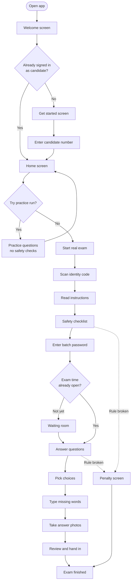
```mermaid
flowchart TD
    Start([Open app]) --> Splash[Welcome screen]
    Splash --> LoggedIn{Already signed in<br/>as candidate?}
    LoggedIn -->|Yes| Home[Home screen]
    LoggedIn -->|No| Intro[Get started screen]
    Intro --> CandLogin[Enter candidate number]
    CandLogin --> Home

    Home --> Practice{Try practice run?}
    Practice -->|Yes| DemoExam[Practice questions<br/>no safety checks]
    Practice -->|No| RealStart[Start real exam]
    DemoExam --> Home

    RealStart --> Identity[Scan identity code]
    Identity --> Instruct[Read instructions]
    Instruct --> Safety[Safety checklist]
    Safety --> BatchLogin[Enter batch password]
    BatchLogin --> Started{Exam time<br/>already open?}
    Started -->|Not yet| Wait[Waiting room]
    Started -->|Yes| Questions[Answer questions]
    Wait --> Questions

    Questions --> MCQ[Pick choices]
    MCQ --> FillBlank[Type missing words]
    FillBlank --> Written[Take answer photos]
    Written --> Review[Review and hand in]
    Review --> Done[Exam finished]

    Safety -.->|Rule broken| Penalty[Penalty screen]
    Questions -.->|Rule broken| Penalty
    Penalty --> Done
```

---

## 2. First open and setup

### 2.1 Welcome screen

**What it does:** Shows the app logo briefly, then decides where to send the candidate.

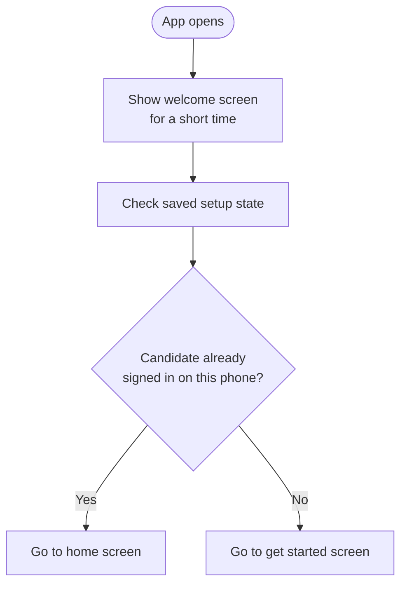
```mermaid
flowchart TD
    A([App opens]) --> B[Show welcome screen<br/>for a short time]
    B --> C[Check saved setup state]
    C --> D{Candidate already<br/>signed in on this phone?}
    D -->|Yes| E[Go to home screen]
    D -->|No| F[Go to get started screen]
```

| If… | Then… |
|-----|--------|
| Candidate was signed in before | Open home screen |
| First time or signed out | Open get started screen |
| Setup state cannot be read | Treat as not signed in |

---

### 2.2 Get started screen

**What it does:** Introduces the app. One button moves to candidate sign-in.

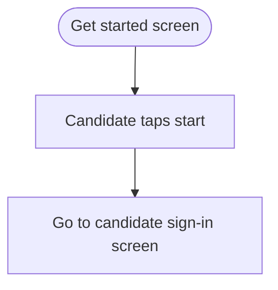
```mermaid
flowchart TD
    A([Get started screen]) --> B[Candidate taps start]
    B --> C[Go to candidate sign-in screen]
```

---

### 2.3 Check setup state

**What it does:** Reads what the app already knows about this phone.

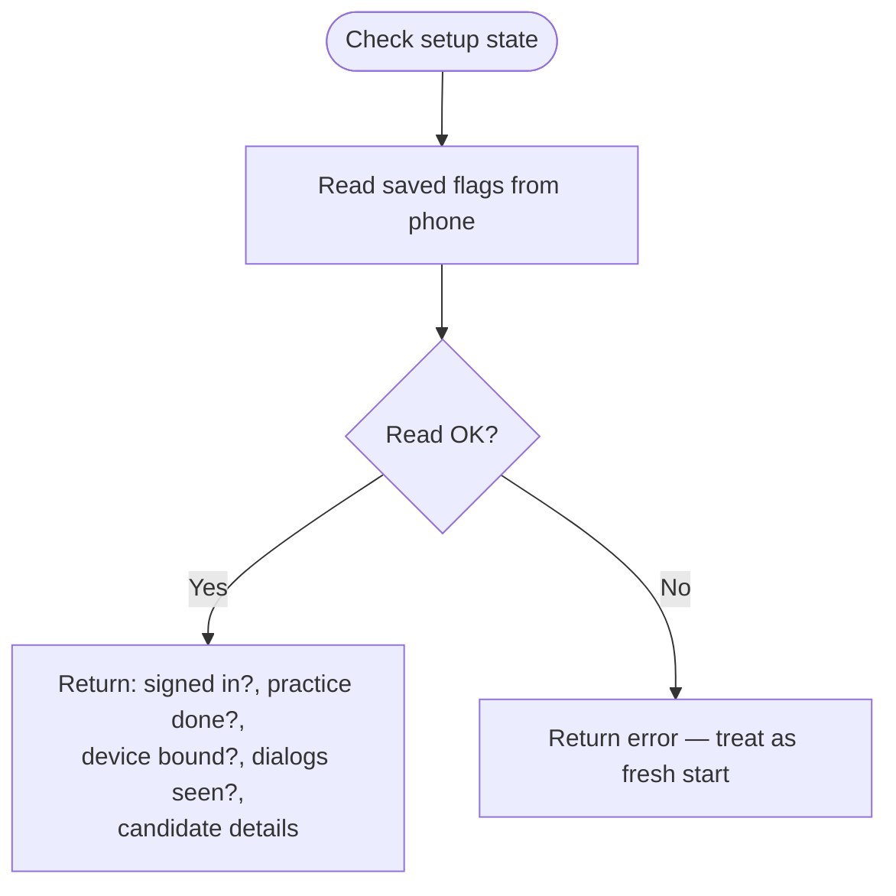
```mermaid
flowchart TD
    A([Check setup state]) --> B[Read saved flags from phone]
    B --> C{Read OK?}
    C -->|Yes| D[Return: signed in?, practice done?,<br/>device bound?, dialogs seen?,<br/>candidate details]
    C -->|No| E[Return error — treat as fresh start]
```

---

### 2.4 Candidate sign-in (first time)

**What it does:** Saves the candidate number on this phone so they do not enter it every time.

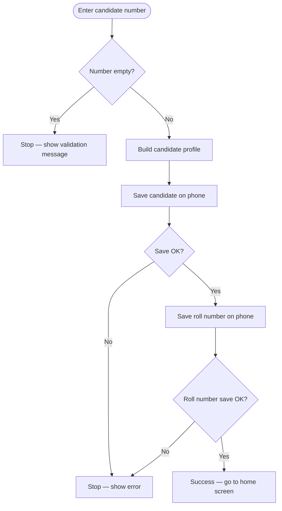
```mermaid
flowchart TD
    A([Enter candidate number]) --> B{Number empty?}
    B -->|Yes| C[Stop — show validation message]
    B -->|No| D[Build candidate profile]
    D --> E[Save candidate on phone]
    E --> F{Save OK?}
    F -->|No| G[Stop — show error]
    F -->|Yes| H[Save roll number on phone]
    H --> I{Roll number save OK?}
    I -->|No| G
    I -->|Yes| J[Success — go to home screen]
```

**Screen behavior:**

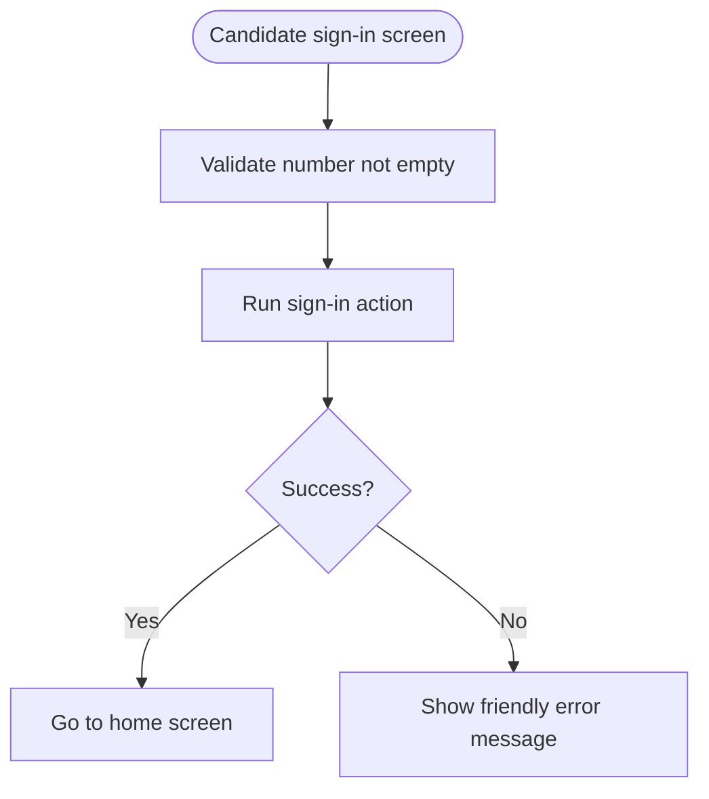
```mermaid
flowchart TD
    A([Candidate sign-in screen]) --> B[Validate number not empty]
    B --> C[Run sign-in action]
    C --> D{Success?}
    D -->|Yes| E[Go to home screen]
    D -->|No| F[Show friendly error message]
```

---

### 2.5 Remember setup milestones

**What it does:** Saves small flags so the app knows what the candidate has already seen or done.

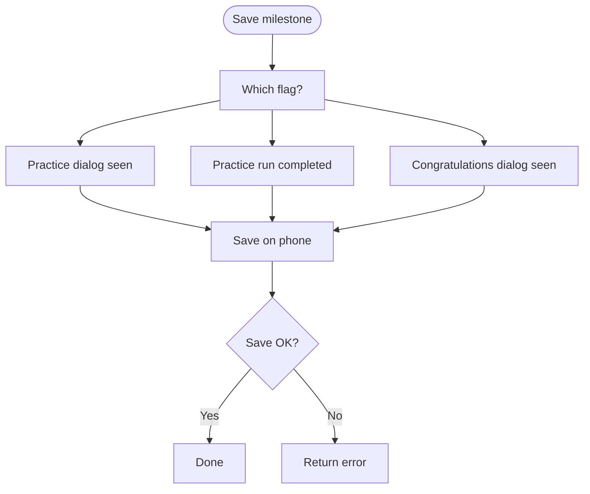
```mermaid
flowchart TD
    A([Save milestone]) --> B[Which flag?]
    B --> C[Practice dialog seen]
    B --> D[Practice run completed]
    B --> E[Congratulations dialog seen]
    C --> F[Save on phone]
    D --> F
    E --> F
    F --> G{Save OK?}
    G -->|Yes| H[Done]
    G -->|No| I[Return error]
```

---

## 3. Signing in as a candidate

These actions support the **batch password** step before real exam questions (see Section 8).

### 3.1 Sign in with roll number

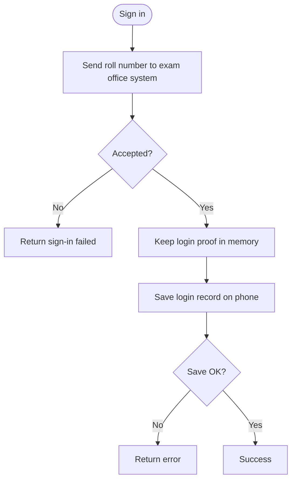
```mermaid
flowchart TD
    A([Sign in]) --> B[Send roll number to exam office system]
    B --> C{Accepted?}
    C -->|No| D[Return sign-in failed]
    C -->|Yes| E[Keep login proof in memory]
    E --> F[Save login record on phone]
    F --> G{Save OK?}
    G -->|No| H[Return error]
    G -->|Yes| I[Success]
```

---

### 3.2 Load saved login record

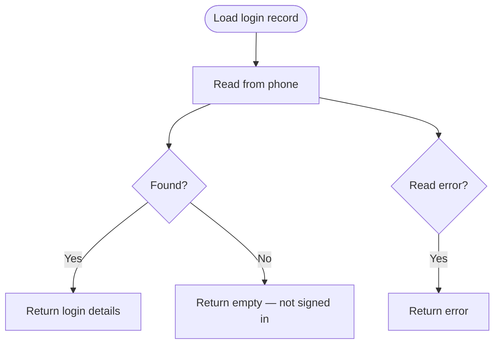
```mermaid
flowchart TD
    A([Load login record]) --> B[Read from phone]
    B --> C{Found?}
    C -->|Yes| D[Return login details]
    C -->|No| E[Return empty — not signed in]
    B --> F{Read error?}
    F -->|Yes| G[Return error]
```

---

### 3.3 Sign out and wipe login

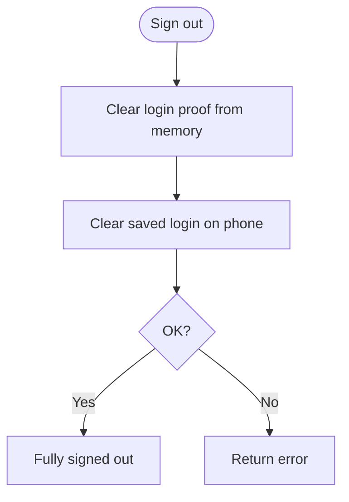
```mermaid
flowchart TD
    A([Sign out]) --> B[Clear login proof from memory]
    B --> C[Clear saved login on phone]
    C --> D{OK?}
    D -->|Yes| E[Fully signed out]
    D -->|No| F[Return error]
```

---

### 3.4 Load district list

**Used on:** Batch login form — candidate picks their district.

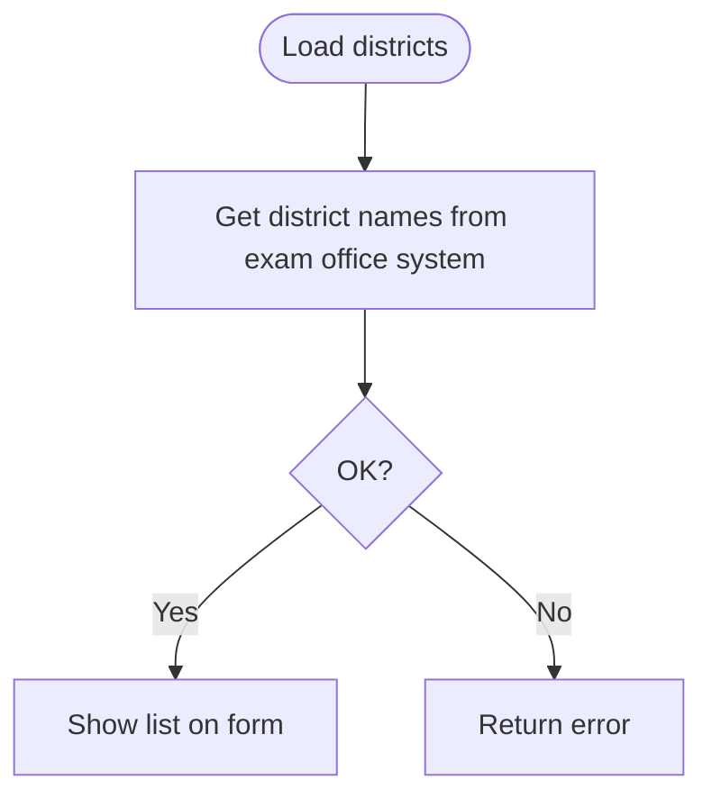
```mermaid
flowchart TD
    A([Load districts]) --> B[Get district names from exam office system]
    B --> C{OK?}
    C -->|Yes| D[Show list on form]
    C -->|No| E[Return error]
```

---

### 3.5 Check if candidate may take the exam

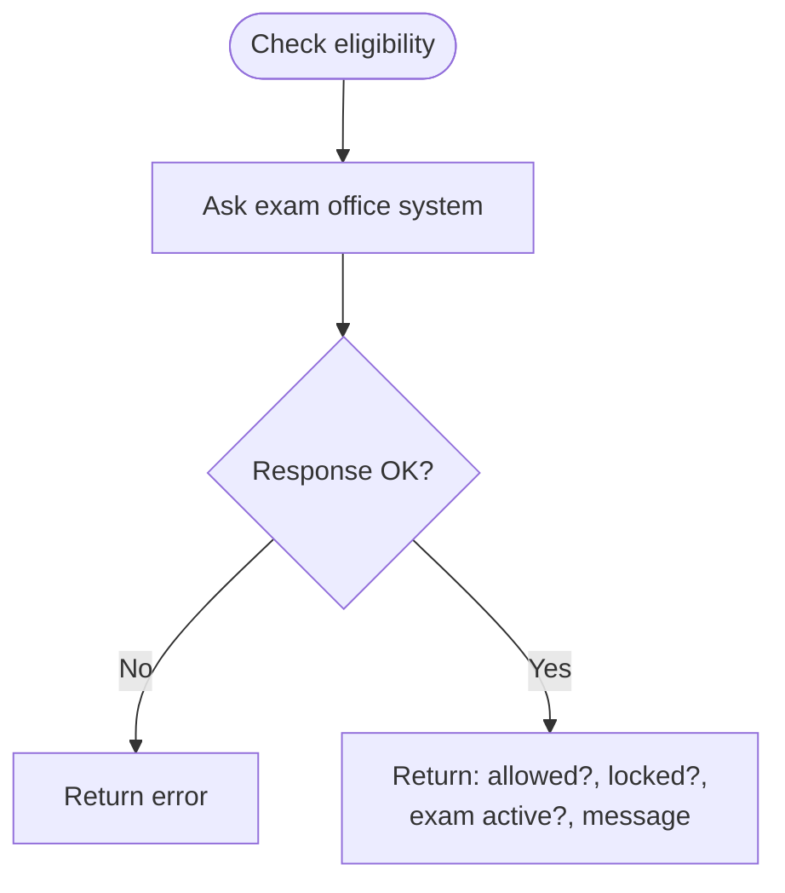
```mermaid
flowchart TD
    A([Check eligibility]) --> B[Ask exam office system]
    B --> C{Response OK?}
    C -->|No| D[Return error]
    C -->|Yes| E[Return: allowed?, locked?,<br/>exam active?, message]
```

| If… | Then… |
|-----|--------|
| Not allowed | Show message — stop |
| Account locked | Show message — stop |
| Exam not active yet | Show message — stop |
| All clear | Continue to exam entry |

---

## 4. Home screen and practice run

### 4.1 Home screen flow

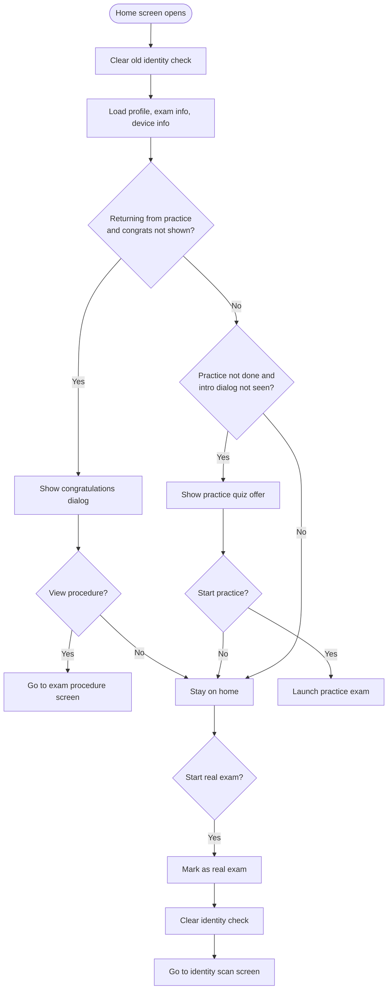
```mermaid
flowchart TD
    A([Home screen opens]) --> B[Clear old identity check]
    B --> C[Load profile, exam info, device info]
    C --> D{Returning from practice<br/>and congrats not shown?}
    D -->|Yes| E[Show congratulations dialog]
    E --> F{View procedure?}
    F -->|Yes| G[Go to exam procedure screen]
    F -->|No| H[Stay on home]
    D -->|No| I{Practice not done and<br/>intro dialog not seen?}
    I -->|Yes| J[Show practice quiz offer]
    J --> K{Start practice?}
    K -->|Yes| L[Launch practice exam]
    K -->|No| H
    I -->|No| H

    H --> M{Start real exam?}
    M -->|Yes| N[Mark as real exam]
    N --> O[Clear identity check]
    O --> P[Go to identity scan screen]
```

---

### 4.2 Start practice exam

**What it does:** Lets the candidate try questions without safety checks or real submission.

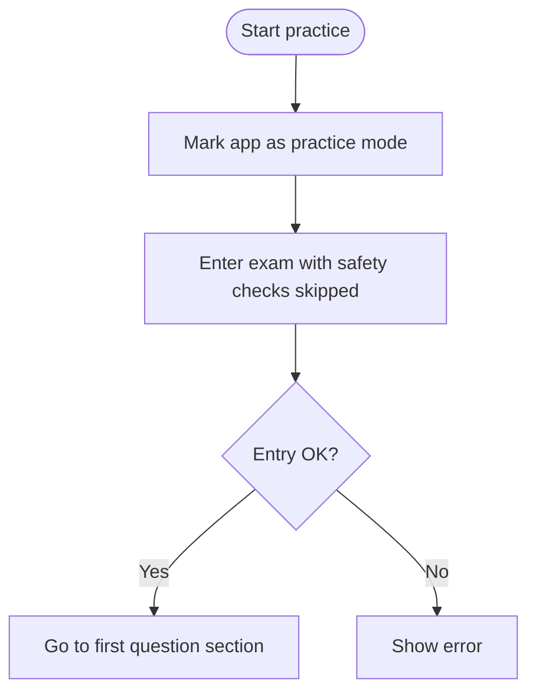
```mermaid
flowchart TD
    A([Start practice]) --> B[Mark app as practice mode]
    B --> C[Enter exam with safety checks skipped]
    C --> D{Entry OK?}
    D -->|Yes| E[Go to first question section]
    D -->|No| F[Show error]
```

---

## 5. Proving who you are

### 5.1 Identity scan screen

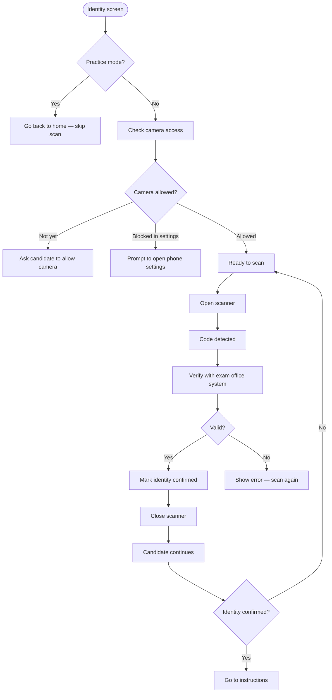
```mermaid
flowchart TD
    A([Identity screen]) --> B{Practice mode?}
    B -->|Yes| C[Go back to home — skip scan]
    B -->|No| D[Check camera access]
    D --> E{Camera allowed?}
    E -->|Not yet| F[Ask candidate to allow camera]
    E -->|Blocked in settings| G[Prompt to open phone settings]
    E -->|Allowed| H[Ready to scan]
    H --> I[Open scanner]
    I --> J[Code detected]
    J --> K[Verify with exam office system]
    K --> L{Valid?}
    L -->|Yes| M[Mark identity confirmed]
    M --> N[Close scanner]
    L -->|No| O[Show error — scan again]
    N --> P[Candidate continues]
    P --> Q{Identity confirmed?}
    Q -->|Yes| R[Go to instructions]
    Q -->|No| H
```

---

### 5.2 Verify identity code

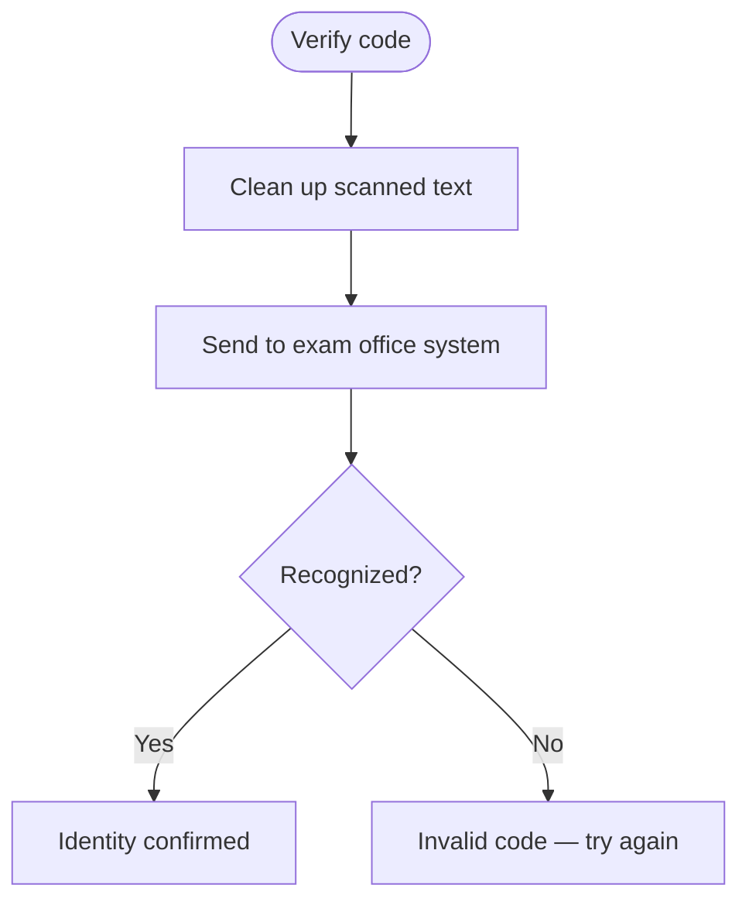
```mermaid
flowchart TD
    A([Verify code]) --> B[Clean up scanned text]
    B --> C[Send to exam office system]
    C --> D{Recognized?}
    D -->|Yes| E[Identity confirmed]
    D -->|No| F[Invalid code — try again]
```

---

## 6. Reading instructions

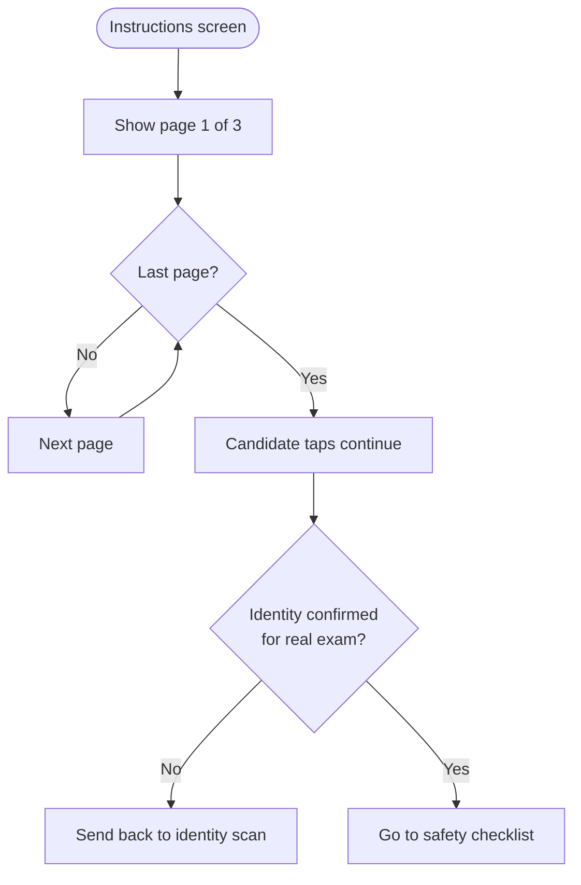
```mermaid
flowchart TD
    A([Instructions screen]) --> B[Show page 1 of 3]
    B --> C{Last page?}
    C -->|No| D[Next page]
    D --> C
    C -->|Yes| E[Candidate taps continue]
    E --> F{Identity confirmed<br/>for real exam?}
    F -->|No| G[Send back to identity scan]
    F -->|Yes| H[Go to safety checklist]
```

---

## 7. Safety checks before the exam

### 7.1 Safety checklist screen

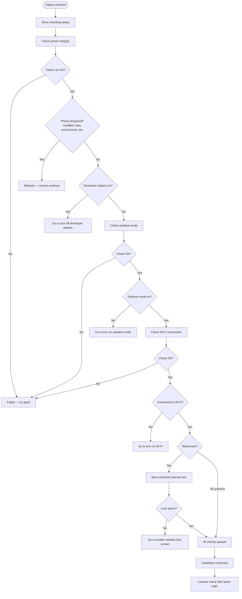
```mermaid
flowchart TD
    A([Safety checklist]) --> B[Show checking status]
    B --> C[Check phone integrity]
    C --> D{Check ran OK?}
    D -->|No| E[Failed — try again]
    D -->|Yes| F{Phone tampered?<br/>modified, fake environment, etc.}
    F -->|Yes| G[Blocked — cannot continue]
    F -->|No| H{Developer options on?}
    H -->|Yes| I[Go to turn off developer options]
    H -->|No| J[Check airplane mode]
    J --> K{Check OK?}
    K -->|No| E
    K -->|Yes| L{Airplane mode on?}
    L -->|No| M[Go to turn on airplane mode]
    L -->|Yes| N[Check Wi‑Fi connection]
    N --> O{Check OK?}
    O -->|No| E
    O -->|Yes| P{Connected to Wi‑Fi?}
    P -->|No| Q[Go to turn on Wi‑Fi]
    P -->|Yes| R{Real exam?}
    R -->|Yes| S[Start restricted internet lock]
    S --> T{Lock active?}
    T -->|No| U[Go to enable network lock screen]
    T -->|Yes| V[All checks passed]
    R -->|No practice| V
    V --> W[Candidate continues]
    W --> X[Camera check then batch login]
```

---

### 7.2 Check phone integrity

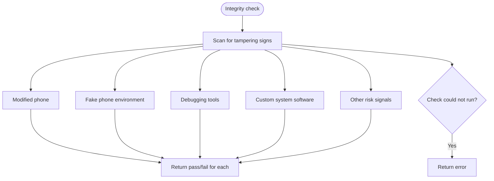
```mermaid
flowchart TD
    A([Integrity check]) --> B[Scan for tampering signs]
    B --> C[Modified phone]
    B --> D[Fake phone environment]
    B --> E[Debugging tools]
    B --> F[Custom system software]
    B --> G[Other risk signals]
    C --> H[Return pass/fail for each]
    D --> H
    E --> H
    F --> H
    G --> H
    B --> I{Check could not run?}
    I -->|Yes| J[Return error]
```

---

### 7.3 Check airplane mode

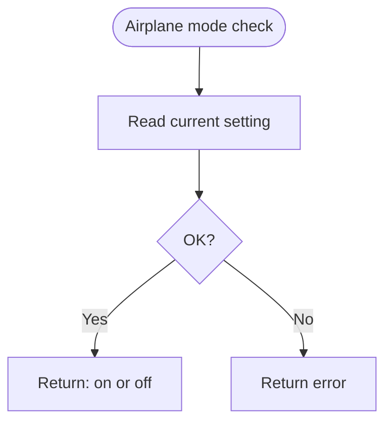
```mermaid
flowchart TD
    A([Airplane mode check]) --> B[Read current setting]
    B --> C{OK?}
    C -->|Yes| D[Return: on or off]
    C -->|No| E[Return error]
```

---

### 7.4 Watch airplane mode changes

```mermaid
flowchart TD
    A([Watch airplane mode]) --> B[Listen for setting changes]
    B --> C[Send update each time it changes]
    C --> D{During exam and turned off?}
    D -->|Yes| E[Trigger rule violation]
```

---

### 7.5 Check internet connection

```mermaid
flowchart TD
    A([Connection check]) --> B[Is phone online?]
    B --> C{OK?}
    C -->|Yes| D[Return: online or offline]
    C -->|No| E[Return error]
```

---

### 7.6 Watch connection changes

```mermaid
flowchart TD
    A([Watch connection]) --> B[Listen for online/offline changes]
    B --> C[Send update when status changes]
```

---

### 7.7 Continue after safety checks pass

```mermaid
flowchart TD
    A([Continue]) --> B{Camera allowed?}
    B -->|No| C[Go to camera permission screen]
    B -->|Yes| D[Go to batch login screen]
```

---

### 7.8 Open phone settings (helper actions)

These simply open the right place in phone settings:

| Action | Opens |
|--------|--------|
| Airplane mode settings | Airplane mode toggle |
| Wi‑Fi settings | Wi‑Fi list |
| Developer options settings | Developer options |

```mermaid
flowchart TD
    A([Open settings]) --> B{Settings opened?}
    B -->|Yes| C[Candidate fixes setting and returns]
    B -->|No| D[Show could not open settings]
```

---

### 7.9 Start ongoing safety monitoring

**When:** After entering the exam (waiting room or questions).

```mermaid
flowchart TD
    A([Start monitoring]) --> B{Practice mode?}
    B -->|Yes| C[Do nothing]
    B -->|No| D[Begin watching:<br/>airplane mode, network lock,<br/>current exam section]
    D --> E{Started OK?}
    E -->|Yes| F[Monitoring active during exam]
    E -->|No| G[Log problem — usually non-blocking]
```

---

### 7.10 Stop ongoing safety monitoring

```mermaid
flowchart TD
    A([Stop monitoring]) --> B[Stop all watches]
    B --> C[Optionally release network lock]
    C --> D[Done]
```

---

### 7.11 Release restricted internet lock

```mermaid
flowchart TD
    A([Release network lock]) --> B[Turn off restricted internet]
    B --> C[Done — normal phone internet restored]
```

---

## 8. Batch login before questions

### 8.1 Batch login screen

```mermaid
flowchart TD
    A([Batch login screen]) --> B{Practice mode?}
    B -->|No| C[Turn on screen protection]
    C --> D[Keep checking safety rules]
    B -->|Yes| E[Skip extra safety polling]
    D --> F[Load candidate number from phone]
    E --> F
    F --> G{Number found?}
    G -->|No| H[Show candidate number not found]
    G -->|Yes| I[Candidate enters batch password]
    I --> J[Sign in with roll number]
    J --> K{Sign-in result?}
    K -->|Wrong password| L[Show inline message]
    K -->|Bad request| M[Show system message]
    K -->|Other error| N[Show friendly error]
    K -->|Success| O[Check exam eligibility]
    O --> P{May take exam?}
    P -->|No| Q[Show reason — stop]
    P -->|Yes| R{Unsent answers<br/>saved on phone?}
    R -->|Yes| S[Try to send leftover answers]
    S --> T{Send OK?}
    T -->|Yes| U[Go to exam finished screen]
    T -->|No internet| V[Show upload failed message]
    T -->|Other error| W[Clear stale data — continue login]
    R -->|No| X[Enter exam after login]
    X --> Y{Entry OK?}
    Y -->|Yes| Z[Go to waiting room or questions]
    Y -->|No| AA[Show message — resume safety checks]
```

---

### 8.2 Enter exam after batch login

```mermaid
flowchart TD
    A([Enter exam]) --> B{Camera allowed?}
    B -->|No| C[Stop — camera required]
    B -->|Yes| D[Start exam attempt with office system]
    D --> E{Exam loaded?}
    E -->|No| F[Stop — something went wrong]
    E -->|Yes| G{Practice mode?}
    G -->|Yes| H[Go straight to first questions]
    G -->|No| I{Network lock active?}
    I -->|No| J[Stop — network lock required]
    I -->|Yes| K{Exam start time<br/>not reached yet?}
    K -->|Yes| L[Start limited monitoring]
    L --> M[Go to waiting room]
    K -->|No| N[Start full monitoring<br/>all question types]
    N --> O[Go to first question section]
```

---

### 8.3 Recover leftover answers after re-login

```mermaid
flowchart TD
    A([Recover leftover answers]) --> B[Send any unsent answer photos]
    B --> C[Refresh exam state from office system]
    C --> D[Hand in exam for marking]
    D --> E[Clear all exam data from phone]
    E --> F{All steps OK?}
    F -->|Yes| G[Go to exam finished screen]
    F -->|No internet| H[Show retry message]
    F -->|Other error| I[Clear stale cache — allow fresh login]
```

---

## 9. Waiting for the exam to start

```mermaid
flowchart TD
    A([Waiting room]) --> B[Show countdown to start time]
    B --> C[Check exam window every few seconds]
    C --> D{Countdown reached zero?}
    D -->|Yes| E[Ask office system for updated status]
    D -->|No| C
    E --> F{Exam window open?}
    F -->|Yes| G[Begin exam]
    G --> H[Start full safety monitoring]
    H --> I[Go to first question section]
    F -->|No| J{Exam locked externally?}
    J -->|Yes| K[Stop timers — show locked state]
    J -->|No| C
```

---

## 10. During the exam — overall flow

### 10.1 Exam session screen logic

```mermaid
flowchart TD
    A([Exam begins]) --> B[Start exam attempt with office system]
    B --> C[Load all questions by type]
    C --> D{Start time reached?}
    D -->|No| E[Handled in waiting room]
    D -->|Yes| F[Start countdown timer]
    F --> G{Time runs out?}
    G -->|Yes| H[Force hand-in automatically]
    G -->|No| I[Candidate answers sections]
    I --> J[Multiple choice]
    J --> K[Fill in blanks]
    K --> L[Written photos]
    L --> M[Review and hand in]
    M --> N[Exam finished]

    I -.->|Rule broken| O[Lock exam — penalty flow]
    F -.->|Rule broken| O
```

---

### 10.2 Start exam attempt

```mermaid
flowchart TD
    A([Start attempt]) --> B[Tell exam office system to begin]
    B --> C{Accepted?}
    C -->|Yes| D[Return timing and section info]
    C -->|No| E[Return error]
```

---

### 10.3 Load current exam

```mermaid
flowchart TD
    A([Load exam]) --> B{Force fresh copy?}
    B -->|Yes| C[Get latest from office system]
    B -->|No| D{Saved copy on phone?}
    D -->|Yes| E[Use saved copy]
    D -->|No| C
    C --> F{OK?}
    F -->|Yes| G[Return name, questions, time window, access flags]
    F -->|No| H[Return error]
```

---

### 10.4 Get remaining time

```mermaid
flowchart TD
    A([Get remaining time]) --> B[Ask office system for timer]
    B --> C{OK?}
    C -->|Yes| D[Return seconds left]
    C -->|No| E[Return error]
    D --> F{Already zero?}
    F -->|Yes| G[Trigger automatic hand-in]
```

---

### 10.5 Save roll number on phone

```mermaid
flowchart TD
    A([Save roll number]) --> B[Write to phone storage]
    B --> C{OK?}
    C -->|Yes| D[Saved]
    C -->|No| E[Error]
```

---

### 10.6 Read roll number from phone

```mermaid
flowchart TD
    A([Read roll number]) --> B[Read from phone storage]
    B --> C{Found?}
    C -->|Yes| D[Return number]
    C -->|No| E[Return empty]
```

---

### 10.7 Lock exam after violation

```mermaid
flowchart TD
    A([Lock exam]) --> B[Tell office system with reason]
    B --> C{OK?}
    C -->|Yes| D[Exam locked — no more answers]
    C -->|No| E[Return error]
```

---

### 10.8 Report rule break and apply penalty

```mermaid
flowchart TD
    A([Report violation]) --> B{Practice mode?}
    B -->|Yes| C[Recorded but exam not locked]
    B -->|No| D[Send violation to office system]
    D --> E[Apply penalty rules]
    E --> F{Penalty requires lock?}
    F -->|Yes| G[Save lock on phone]
    G --> H[Lock on office system]
    F -->|No| I[Warning only]
    H --> J[Return penalty result and message]
    I --> J
```

---

### 10.9 Check for unsent answers on phone

```mermaid
flowchart TD
    A([Check unsent answers]) --> B{Any saved text/choice<br/>answers on phone?}
    B -->|Yes| C[Return: has unsent data]
    B -->|No| D{Any answer photos<br/>not yet sent?}
    D -->|Yes| C
    D -->|No| E[Return: nothing pending]
```

---

### 10.10 Send all unsent answer photos

```mermaid
flowchart TD
    A([Send all photos]) --> B[Load list of answer photos]
    B --> C[For each photo]
    C --> D{Already sent?}
    D -->|Yes| E[Skip]
    D -->|No| F{Photo file still on phone?}
    F -->|No| G[Stop — file missing]
    F -->|Yes| H[Send to office system]
    H --> I{Send OK?}
    I -->|No| J[Stop — send failed]
    I -->|Yes| K[Mark as sent on phone]
    K --> L[Save draft for that question]
    E --> M{More photos?}
    L --> M
    M -->|Yes| C
    M -->|No| N[All done]
```

---

### 10.11 Hand in exam for marking

```mermaid
flowchart TD
    A([Hand in exam]) --> B[Send finalize request to office system]
    B --> C{Accepted?}
    C -->|Yes| D[Return receipt with time]
    C -->|No| E[Return error]
```

---

### 10.12 Finish exam (standard)

```mermaid
flowchart TD
    A([Finish exam]) --> B[Call office system finish for this attempt]
    B --> C{OK?}
    C -->|Yes| D[Return receipt]
    C -->|No| E[Return error]
```

---

### 10.13 Force hand-in when time expires

```mermaid
flowchart TD
    A([Time expired]) --> B[Call office system auto-hand-in]
    B --> C{OK?}
    C -->|Yes| D[Return receipt]
    C -->|No| E[Return error]
```

---

### 10.14 Hand in saved answers (e.g. on violation)

```mermaid
flowchart TD
    A([Hand in saved answers]) --> B[Push all pending text/choice drafts]
    B --> C[Send all unsent photos]
    C --> D{Photos sent OK?}
    D -->|No| E[Stop — error]
    D -->|Yes| F[Refresh exam from office system]
    F --> G[Hand in for marking]
    G --> H[Clear all exam data from phone]
    H --> I{All OK?}
    I -->|Yes| J[Success receipt]
    I -->|No| K[Return error]
```

---

### 10.15 Manual hand-in from review screen

Same steps as 10.14, plus returns exam name and time for the finished screen.

```mermaid
flowchart TD
    A([Manual hand-in]) --> B[Send unsent photos]
    B --> C[Refresh exam state]
    C --> D[Hand in for marking]
    D --> E[Clear phone exam data]
    E --> F[Return receipt + exam details]
```

---

### 10.16 Clear all exam data from phone

```mermaid
flowchart TD
    A([Clear exam data]) --> B[Remove saved answer photos]
    B --> C[Remove saved answers and exam copy]
    C --> D{Both OK?}
    D -->|Yes| E[Phone clean]
    D -->|No| F[Return error]
```

---

### 10.17 Build review screen summary

```mermaid
flowchart TD
    A([Build summary]) --> B[Load all saved answer drafts]
    B --> C[Count answered questions]
    C --> D[Calculate time spent]
    D --> E[Build summary:<br/>name, batch, duration,<br/>answered vs total]
    E --> F{Drafts loaded OK?}
    F -->|Yes| G[Show on review screen]
    F -->|No| H[Return error]
```

---

## 11. Multiple-choice questions

### 11.1 Screen flow

```mermaid
flowchart TD
    A([Multiple choice section]) --> B[Load questions and prior picks]
    B --> C[Jump to first unanswered]
    C --> D[Candidate picks an option]
    D --> E[Save pick on phone]
    E --> F{Save OK and not last question?}
    F -->|Yes| G[Move to next question]
    F -->|No| H[Stay or finish section]
    G --> D
    H --> I{Section complete?}
    I -->|Yes| J[Move to fill-in-the-blank section]
    I -->|No| D
```

---

### 11.2 Load multiple-choice questions

```mermaid
flowchart TD
    A([Load questions]) --> B[Get question list for this attempt]
    B --> C{OK?}
    C -->|Yes| D[Return questions with options]
    C -->|No| E[Return error]
```

---

### 11.3 Load saved picks

```mermaid
flowchart TD
    A([Load progress]) --> B[Read saved picks from phone]
    B --> C{OK?}
    C -->|Yes| D[Return map of question → chosen option]
    C -->|No| E[Return error]
```

---

### 11.4 Save a pick

```mermaid
flowchart TD
    A([Save pick]) --> B[Store choice on phone]
    B --> C{OK?}
    C -->|Yes| D[Saved — survives no internet]
    C -->|No| E[Return error]
```

---

## 12. Fill-in-the-blank questions

### 12.1 Screen flow

```mermaid
flowchart TD
    A([Fill-in section]) --> B[Load questions and saved text]
    B --> C[Candidate types answer]
    C --> D[Save on continue]
    D --> E{Previous or skip?}
    E --> F[Navigate without forcing answer on skip]
    F --> G{Section complete?}
    G -->|Yes| H[Move to written photo section]
    G -->|No| C
```

---

### 12.2 Load fill-in questions

```mermaid
flowchart TD
    A([Load questions]) --> B[Get fill-in question list]
    B --> C{OK?}
    C -->|Yes| D[Return questions]
    C -->|No| E[Return error]
```

---

### 12.3 Load saved text answers

```mermaid
flowchart TD
    A([Load progress]) --> B[Read saved text from phone]
    B --> C{OK?}
    C -->|Yes| D[Return question → text map]
    C -->|No| E[Return error]
```

---

### 11.4 Save typed answer

```mermaid
flowchart TD
    A([Save answer]) --> B[Store trimmed text on phone]
    B --> C{OK?}
    C -->|Yes| D[Saved]
    C -->|No| E[Return error]
```

---

## 13. Written answers with photos

### 13.1 Screen flow

```mermaid
flowchart TD
    A([Written section]) --> B[Load saved photos on open]
    B --> C[Candidate takes photo per question]
    C --> D[Stage photo on phone]
    D --> E{Send now?}
    E -->|Yes| F[Send with progress shown]
    E -->|No| G[Keep staged locally]
    F --> H{Move to next question?}
    G --> H
    H --> I{Current question has photo?}
    I -->|No| J[Cannot advance — photo required]
    I -->|Yes| K[Save draft and continue]
    K --> L{Last section done?}
    L -->|Yes| M[Go to review and hand in]
    L -->|No| C
```

---

### 13.2 Load saved answer photos

```mermaid
flowchart TD
    A([Load photos]) --> B[Read all staged photos from phone]
    B --> C{OK?}
    C -->|Yes| D[Return list with sent/not sent status]
    C -->|No| E[Return error]
```

---

### 13.3 Stage new photo

```mermaid
flowchart TD
    A([Add photo]) --> B[Link photo file to question]
    B --> C{OK?}
    C -->|Yes| D[Photo staged locally]
    C -->|No| E[Return error]
```

---

### 13.4 Replace photo

```mermaid
flowchart TD
    A([Replace photo]) --> B[Swap file for existing staged photo]
    B --> C{OK?}
    C -->|Yes| D[Updated]
    C -->|No| E[Return error]
```

---

### 13.5 Remove staged photo

```mermaid
flowchart TD
    A([Remove photo]) --> B[Delete record and file]
    B --> C{OK?}
    C -->|Yes| D[Removed]
    C -->|No| E[Return error]
```

---

### 13.6 Send one answer photo

```mermaid
flowchart TD
    A([Send photo]) --> B[Upload file for question]
    B --> C{OK?}
    C -->|Yes| D[Return office system answer id]
    C -->|No| E[Return send failed]
```

---

### 13.7 Mark photo as sent

```mermaid
flowchart TD
    A([Mark sent]) --> B[Link local photo to office answer id]
    B --> C[Set status to sent]
    C --> D{OK?}
    D -->|Yes| E[Updated on phone]
    D -->|No| F[Return error]
```

---

### 13.8 Save written answer draft

```mermaid
flowchart TD
    A([Save draft]) --> B[Persist draft for question<br/>including sent photo refs]
    B --> C{OK?}
    C -->|Yes| D[Ready for final hand-in]
    C -->|No| E[Return error]
```

---

### 13.9 Send single staged photo by id

```mermaid
flowchart TD
    A([Send one staged photo]) --> B[Upload through written exam layer]
    B --> C[Report progress]
    C --> D{OK?}
    D -->|Yes| E[Done]
    D -->|No| F[Return error]
```

---

### 13.10 Hand in written section only

**Note:** Main real exam flow uses full exam hand-in instead. This action exists for the written section alone.

```mermaid
flowchart TD
    A([Submit written section]) --> B[Call office system written submit]
    B --> C{OK?}
    C -->|Yes| D[Receipt returned]
    C -->|No| E[Return error]
```

---

## 14. Review and hand in

### 14.1 Review screen flow

```mermaid
flowchart TD
    A([Review screen]) --> B[Load summary:<br/>name, time, answered count]
    B --> C[Candidate confirms hand-in]
    C --> D{Internet available?}
    D -->|No| E[Wait for connection]
    E --> F{Comes online?}
    F -->|Yes| G[Auto retry hand-in]
    F -->|No| E
    D -->|Yes| G
    G --> H[Send unsent photos]
    H --> I[Hand in for marking]
    I --> J[Clear phone exam data]
    J --> K{Photo file missing?}
    K -->|Yes| L[Stop retry — show error]
    K -->|No| M{Hand-in OK?}
    M -->|Yes| N[Go to exam finished screen]
    M -->|No| O[Show friendly error]
```

---

## 15. Exam finished screen

```mermaid
flowchart TD
    A([Exam finished screen]) --> B[Show exam name, time, how submitted]
    B --> C{Real exam or practice?}
    C -->|Real| D[Stop safety monitoring]
    D --> E[Release network lock]
    E --> F[Clear exam data from phone]
    F --> G[Sign out login record]
    G --> H[Candidate taps done]
    H --> I[Exit app]
    C -->|Practice| J[Stop monitoring]
    J --> K[Clear practice exam data]
    K --> L[Mark practice as completed]
    L --> M[Reset practice context]
    M --> N[Candidate taps done]
    N --> O[Return to home — may show congratulations]
```

---

## 16. When a rule is broken

### 16.1 Handle security violation (system action)

```mermaid
flowchart TD
    A([Rule broken detected]) --> B{Practice mode?}
    B -->|Yes| C[Ignore — no penalty]
    B -->|No| D{Already handled?}
    D -->|Yes| C
    D -->|No| E[Lock exam on phone]
    E --> F[Report to office system]
    F --> G[Apply penalty]
    G --> H{Exam attempt exists?}
    H -->|Yes| I[Try to hand in saved answers]
    H -->|No| J[Skip hand-in]
    I --> K{Hand-in still pending?}
    K -->|No| L[Release network lock]
    K -->|Yes| M[Keep lock until sent]
    J --> N[Go to penalty screen]
    L --> N
    M --> N
    N --> O{App in foreground?}
    O -->|No| P[Wait until candidate returns]
    P --> N
    O -->|Yes| N
```

---

### 16.2 Penalty screen flow

```mermaid
flowchart TD
    A([Penalty screen]) --> B[Show what rule was broken]
    B --> C[Show penalty info]
    C --> D{Answers already sent?}
    D -->|Yes| E[Show answers were submitted]
    D -->|No| F{Auto retry allowed?}
    F -->|Yes| G[Watch for internet]
    G --> H{Online?}
    H -->|Yes| I[Retry hand-in]
    I --> J{Success?}
    J -->|Yes| K[Mark sent — release network lock]
    J -->|No| L{Photo file missing?}
    L -->|Yes| M[Stop retry — show error — release lock]
    L -->|No| N{Network error?}
    N -->|Yes| G
    N -->|No| O[Stop retry — show error]
    F -->|No| P[Show final state]
```

**Common reasons a rule breaks during the exam:**

| What happened | Typical result |
|---------------|----------------|
| Airplane mode turned off | Exam locked, penalty applied |
| Wi‑Fi disconnected | May block hand-in until back online |
| Network lock disabled | Redirect to fix settings or violation |
| App left or screen captured | Violation reported |
| Time runs out | Automatic hand-in |

---

## 17. Resetting the phone binding

**What it does:** Lets a candidate unlink this phone and wipe all exam-related saved data (home screen → unbind).

```mermaid
flowchart TD
    A([Unbind device]) --> B[Stop safety monitoring]
    B --> C[Release network lock]
    C --> D{Screen protection on?}
    D -->|Yes| E[Turn off screen protection]
    D -->|No| F[Clear all exam data from phone]
    E --> F
    F --> G{Clear exam OK?}
    G -->|No| H[Stop — show error]
    G -->|Yes| I[Sign out login record]
    I --> J{Sign out OK?}
    J -->|No| H
    J -->|Yes| K[Clear all setup data]
    K --> L{Clear setup OK?}
    L -->|No| H
    L -->|Yes| M[Clear identity and exam run flags]
    M --> N[Success — go to get started screen]
```

**Screen confirmation:**

```mermaid
flowchart TD
    A([Tap unbind on home]) --> B[Show confirm dialog]
    B --> C{Confirmed?}
    C -->|No| D[Stay on home]
    C -->|Yes| E[Run unbind action]
    E --> F{Success?}
    F -->|Yes| G[Go to get started]
    F -->|No| H[Show error — stay on home]
```

---

## 18. Quick reference — all actions listed

| Area | Action | One-line purpose |
|------|--------|------------------|
| Setup | Check setup state | Know if candidate already signed in |
| Setup | Candidate sign-in | Save candidate number on phone |
| Setup | Remember milestone | Track practice/dialog flags |
| Setup | Unbind device | Wipe phone and start over |
| Sign-in | Sign in with roll number | Prove batch password to office system |
| Sign-in | Load login record | Read saved sign-in |
| Sign-in | Sign out | Clear login from phone |
| Sign-in | Load districts | Fill batch login form |
| Sign-in | Check eligibility | Confirm candidate may take exam |
| Identity | Verify identity code | Confirm QR scan with office system |
| Safety | Check phone integrity | Detect tampered or unsafe phone |
| Safety | Check airplane mode | Confirm airplane mode on |
| Safety | Watch airplane mode | React if turned off during exam |
| Safety | Check connection | Know if online |
| Safety | Watch connection | React to online/offline changes |
| Safety | Continue after checks | Route to camera or batch login |
| Safety | Open settings helpers | Send candidate to fix phone settings |
| Safety | Start monitoring | Watch rules during exam |
| Safety | Stop monitoring | End watches after exam |
| Safety | Release network lock | Restore normal internet |
| Safety | Handle violation | Lock, report, hand in, show penalty |
| Exam | Start attempt | Begin official exam with office system |
| Exam | Enter after batch login | Route to waiting room or questions |
| Exam | Load exam | Get questions and time window |
| Exam | Get remaining time | Drive countdown timer |
| Exam | Save/read roll number | Store candidate roll on phone |
| Exam | Lock exam | Block further answers after violation |
| Exam | Report violation | Send penalty to office system |
| Exam | Check unsent answers | Find leftover data on phone |
| Exam | Send all photos | Upload staged answer images |
| Exam | Hand in for marking | Submit exam to office system |
| Exam | Finish exam | Standard completion call |
| Exam | Force hand-in on timeout | Auto submit when time ends |
| Exam | Hand in saved answers | Flush local data on violation |
| Exam | Manual hand-in | Candidate confirms on review screen |
| Exam | Recover leftover answers | After re-login with unsent data |
| Exam | Clear exam data | Remove all local exam files |
| Exam | Build review summary | Count answers and time for review screen |
| Multiple choice | Load questions | Get MCQ list |
| Multiple choice | Load progress | Restore prior picks |
| Multiple choice | Save pick | Store choice on phone |
| Fill-in | Load questions | Get fill-in list |
| Fill-in | Load progress | Restore typed answers |
| Fill-in | Save answer | Store text on phone |
| Written | Load photos | List staged images |
| Written | Stage/replace/remove photo | Manage local answer photos |
| Written | Send photo | Upload to office system |
| Written | Mark sent | Update local status |
| Written | Save draft | Prepare for final hand-in |
| Written | Submit section only | Optional written-only submit |
| Practice | Start practice exam | Try questions without safety gates |

---

## Document info

- **Covers:** All app actions under `lib/features/**/domain/usecases/` plus main screen flows.
- **Language:** Plain descriptions — no code terms.
- **Diagrams:** Mermaid — view in GitHub, VS Code, or any Mermaid viewer.

For security gate details aimed at reviewers, see [security_gates_byod.md](./security_gates_byod.md).
