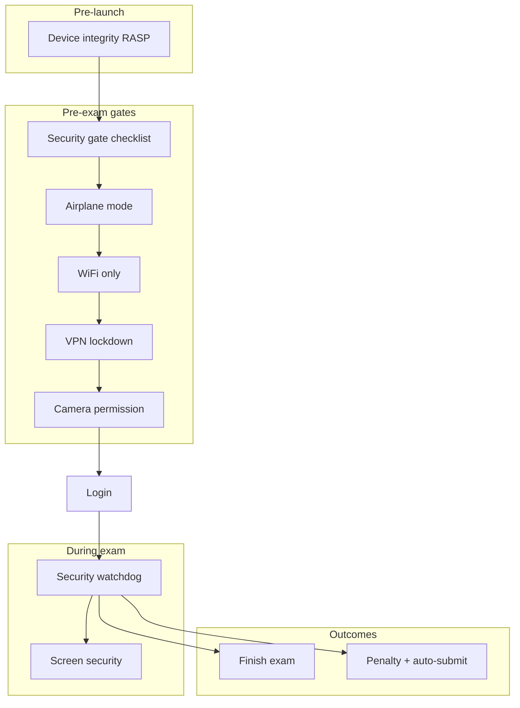

# Security Gates — BYOD Military Exam App

**Military Exam Application**  
**Audience:** Proctors, security reviewers, and engineering  
**Context:** Bring Your Own Device (BYOD) — examinees use personal phones, not MDM-managed kiosk hardware.

This document describes every security gate and runtime control in the app, what each is meant to stop, and the **pros, cons, and BYOD limitations** of each layer.

For RASP / root-detection internals, see [advanced_root_detection_implementation.md](./advanced_root_detection_implementation.md).

---

## Table of Contents

1. [How security is layered](#how-security-is-layered)
2. [Gate flow (examinee journey)](#gate-flow-examinee-journey)
3. [Pre-launch gate](#1-pre-launch-gate-app-start)
4. [Central security gate](#2-central-security-gate)
5. [Sub-gates](#3-sub-gates-redirect-screens)
6. [Login re-verification](#4-login-re-verification)
7. [Runtime exam watchdog](#5-runtime-exam-watchdog)
8. [Violation and penalty system](#6-violation-and-penalty-system)
9. [VPN network lockdown](#7-vpn-network-lockdown)
10. [Screen capture prevention](#8-screen-capture-prevention)
11. [BYOD summary matrix](#byod-summary-matrix)
12. [What BYOD cannot fully prevent](#what-byod-cannot-fully-prevent)
13. [Key source files](#key-source-files)

---

## How security is layered

The app uses **defence in depth**: multiple independent checks before and during the exam. No single gate is sufficient on consumer BYOD hardware.

**Design principle:** Gates are **additive**. Airplane mode, WiFi, and VPN work together — airplane disables cellular; WiFi gives the exam app network access; VPN sinkholes other apps on WiFi.

---

## Gate flow (examinee journey)

| Order | Screen / check | Route | Blocking? |
|-------|----------------|-------|-----------|
| 0 | App launch RASP | `main.dart` | Yes — app won't start |
| 1 | Instructions | `/instructions` | Informational |
| 2 | Security gate | `/security/gate` | Yes — must pass checklist |
| 3a | Developer mode | `/security/developer-mode` | Yes — if dev options on |
| 3b | Airplane mode | `/security/airplane-mode` | Yes — if airplane off |
| 3c | WiFi | `/security/wifi-mode` | Yes — if WiFi off |
| 3d | VPN lockdown | `/security/vpn-lockdown` | Yes — if VPN denied/inactive |
| 3e | Camera permission | `/security/camera-permission` | Yes — for written exam |
| 4 | Login | `/login` | Re-polls gates every 2s |
| 5 | Exam waiting / phases | `/exam/*` | Watchdog active |
| 6 | Finish or violation | `/exam/finish` or `/violation` | VPN released on terminal exit |

---

## 1. Pre-launch gate (app start)

**What it does:** Before the main app loads, `SecurityService` runs RASP (Runtime Application Self-Protection) via `advanced_root_detection`. If a **blocking** integrity issue is found, the user sees `DeviceCompromisedApp` and cannot proceed.

**Blocks:**
- Rooted Android devices
- Jailbroken iOS devices
- Custom ROM (when `strictExamIntegrity` is enabled)
- RASP check failure

**Source:** [`lib/main.dart`](../lib/main.dart), [`lib/core/services/security_service.dart`](../lib/core/services/security_service.dart)

| Pros | Cons / limitations (BYOD) |
|------|---------------------------|
| Stops obviously compromised devices before any exam UI | Determined attackers with hiding root/jailbreak tools may evade RASP |
| Fast fail — no wasted proctor time on bad devices | False positives possible on unusual but legitimate devices |
| Runs once at cold start; no user action needed | Does not re-block if device is compromised *after* launch until watchdog re-checks |
| Custom ROM block is configurable per build mode | Strict ROM policy may exclude valid aftermarket OS users |

---

## 2. Central security gate

**What it does:** Single checklist screen that runs checks in sequence and shows pass/fail per item.

**Checklist items** ([`security_checklist.dart`](../lib/features/security_gate/presentation/widgets/security_checklist.dart)):

1. Device free of root / jailbreak  
2. No custom ROM (Android only)  
3. Developer mode inactive  
4. Airplane mode on  
5. WiFi connected  
6. Network lockdown (VPN) active  

**Source:** [`security_gate_controller.dart`](../lib/features/security_gate/presentation/controllers/security_gate_controller.dart)

| Pros | Cons / limitations (BYOD) |
|------|---------------------------|
| Clear UX — examinee sees exactly what failed | Multiple manual steps (airplane → WiFi → VPN consent) — friction on BYOD |
| Minimum display time (~1.2s) prevents flash-of-pass | User can leave app to fix settings; must return and pass again |
| Fails closed — any check failure redirects to sub-gate | Integrity re-check at gate may differ from app-launch RASP timing |
| Demo build skips real VPN while keeping other gates | Production requires all gates in order |

---

## 3. Sub-gates (redirect screens)

### 3a. Developer mode required

**Route:** `/security/developer-mode`  
**Trigger:** Developer options / USB debugging enabled (Android); developer-related signals from RASP.

| Pros | Cons / limitations (BYOD) |
|------|---------------------------|
| Reduces ADB debugging, logcat, and hooking attack surface | Many BYOD power users keep developer mode on — support burden |
| Dedicated screen with settings deep-link | iOS has no direct developer-mode off switch — opens general Settings |
| Re-checked on app resume | Developer mode alone is not always malicious intent |

---

### 3b. Airplane mode required

**Route:** `/security/airplane-mode`  
**Trigger:** Airplane mode off at gate, login poll, or during exam (watchdog).

| Pros | Cons / limitations (BYOD) |
|------|---------------------------|
| Disables cellular — blocks mobile data for other apps | Examinee must manually re-enable WiFi after airplane (two-step UX) |
| Stops incoming calls/SMS on most devices | Some OEMs behave differently; airplane detection is OS-dependent |
| Stream + poll monitoring during exam | Disabling airplane mid-exam triggers **penalty + auto-submit** |
| Works without MDM | Does not block WiFi-only cheating until VPN is also active |

---

### 3c. WiFi mode required

**Route:** `/security/wifi-mode`  
**Trigger:** Airplane on but WiFi off (no `ConnectivityResult.wifi`).

**Note:** Online = WiFi only in [`security_local_datasource.dart`](../lib/features/security_gate/data/datasources/security_local_datasource.dart). Cellular is intentionally excluded because airplane mode should disable it.

| Pros | Cons / limitations (BYOD) |
|------|---------------------------|
| Ensures exam API reachable while cellular is off | Mobile hotspot / shared WiFi from another device is still “WiFi” |
| Observes connectivity changes on login screen | Ethernet or USB tethering may not register as WiFi |
| Non-penalizing connectivity snackbars during exam (separate from this gate) | `wifiDisabledDuringExam` violation type exists in code but is **not** currently enforced by the watchdog |

---

### 3d. VPN lockdown required

**Route:** `/security/vpn-lockdown`  
**Trigger:** VPN permission denied, tunnel failed to start, or tunnel dropped.

**Mechanism (Android):** Local sinkhole VPN — routes `0.0.0.0/0` and `::/0`, drops packets, **bypasses exam app** via `addDisallowedApplication()`.  
**Mechanism (iOS):** Packet Tunnel Provider (requires Network Extension entitlement and Xcode target setup).

| Pros | Cons / limitations (BYOD) |
|------|---------------------------|
| Blocks other apps' internet on WiFi without MDM | User must approve system VPN consent dialog |
| Exam app keeps direct API access (bypass pattern) | Persistent foreground notification on Android (OS requirement) |
| IPv4 + IPv6 routes reduce leak bypass | iOS extension has ~15–30 MB RAM ceiling — OOM kills tunnel |
| VPN revoke mid-exam → penalty + auto-submit | Second physical device for cheating is not blocked |
| Released after finish or terminal penalty submit | iOS Packet Tunnel target must be fully provisioned in Xcode for production |

---

### 3e. Camera permission required

**Route:** `/security/camera-permission`  
**Trigger:** Written exam needs camera for answer capture; permission not yet granted.

| Pros | Cons / limitations (BYOD) |
|------|---------------------------|
| Ensures written section can capture pages | Permanent deny requires manual Settings visit |
| Gate before login avoids mid-exam permission surprise | Camera opens in-app; lifecycle grace period applied during capture |
| Standard OS permission model | Does not prevent photographing screen with a second device |

---

### 3f. Security error (device compromised)

**Route:** `/security/error`  
**Trigger:** Root, jailbreak, custom ROM, or integrity failure surfaced during gate.

| Pros | Cons / limitations (BYOD) |
|------|---------------------------|
| Hard stop with clear messaging | No remediation path except different device |
| Aligns with military exam trust model | May block BYOD users with outdated security patches flagged incorrectly |

---

## 4. Login re-verification

**What it does:** While on the login screen (not during active exam routes), a **2-second poll** re-checks developer mode, airplane mode, WiFi, and VPN. Returning from Settings triggers a delayed re-check (~400ms).

**Source:** [`login_controller.dart`](../lib/features/auth/presentation/controllers/login_controller.dart)

| Pros | Cons / limitations (BYOD) |
|------|---------------------------|
| Closes gap between gate pass and exam start | Polling only on login — not on every pre-exam screen |
| Catches settings changed while waiting to sign in | Active exam routes are excluded from redirect (`ExamRouteUtils.isOnActiveExamRoute`) |
| Same rules as gate — consistent policy | User frustration if toggling settings accidentally before login |

---

## 5. Runtime exam watchdog

**What it does:** `SecurityWatchdogService` runs during login (limited policy), waiting room, and active exam phases (MCQ, fill-blank, written).

**Default policy during exam:**
- `requireAirplaneMode: true`
- `requireVpnLockdown: true` (non-demo)
- `monitorLifecycle: true`
- `preventScreenCapture: true`
- Poll interval: 3 seconds
- Lifecycle grace: 1 second before background/minimize violation

**Source:** [`security_watchdog_service.dart`](../lib/core/services/security_watchdog_service.dart)

| Monitored signal | Violation? | Notes |
|------------------|------------|-------|
| Airplane mode off | Yes — penalized | |
| VPN disconnected / revoked | Yes — penalized | |
| App backgrounded (paused) | Yes — after 1s grace | |
| App minimized (hidden) | Yes — after 1s grace | |
| Rooted device (re-check) | Yes — penalized | During active phases only |
| WiFi drop | No — snackbar only | [`ExamConnectivityAlertService`](../lib/core/services/exam_connectivity_alert_service.dart) |
| Camera capture active | Lifecycle violations suppressed | Written exam scanner |

| Pros | Cons / limitations (BYOD) |
|------|---------------------------|
| Continuous enforcement during exam | 1s lifecycle grace may allow brief task switch on some OEMs |
| VPN kept during penalty submit until API completes | No kiosk / lock-task mode — Home and Recents still work until violation fires |
| Composable `SecurityPolicy` per phase | Watchdog stopped on violation before submit; VPN released after terminal submit |
| Screen security tied to watchdog lifecycle | Split-screen multitasking behaviour varies by Android version |

---

## 6. Violation and penalty system

**What it does:** On violation, `HandleSecurityViolationUseCase` locks the session, reports to server, auto-submits saved answers, navigates to penalty screen. Offline submit retries on violation screen until success or terminal failure.

**Penalized violation types** ([`penalty_repository_impl.dart`](../lib/features/exam_session/data/repositories/penalty_repository_impl.dart)):

| Violation | Typical cause |
|-----------|---------------|
| `airplaneModeDisabled` | User turned off airplane during exam |
| `vpnDisconnected` | User revoked VPN or tunnel crashed |
| `appBackgrounded` | Left app (paused) |
| `appMinimized` | Recent apps / gesture away |
| `screenshotTaken` | Screen capture attempt |
| `screenRecordingDetected` | Screen recording |
| `rootedDevice` | Integrity re-check failed mid-exam |
| `jailbreakDetected` | iOS integrity failure |
| `developerModeEnabled` | Developer mode detected mid-exam |

**VPN teardown:** VPN stays active during submit/retry; released when submit reaches a **terminal** outcome (success, or no more retry). See `StopExamVpnLockdownUseCase`.

| Pros | Cons / limitations (BYOD) |
|------|---------------------------|
| Automatic evidence + answer preservation | Network failure during submit may delay VPN release |
| Consistent server-side audit trail | False positive lifecycle events possible on low-RAM devices |
| Retry path for offline penalty submit | User cannot continue exam after penalty — by design |
| Bengali UX for examinees | Secondary device cheating not detectable as a violation |

---

## 7. VPN network lockdown

Detailed technical spec: sinkhole + bypass pattern (not a remote VPN).

| Aspect | Android | iOS |
|--------|---------|-----|
| Min SDK | API 29 | iOS 15+ (extension) |
| Exam app traffic | Bypassed via `addDisallowedApplication` | Host app outside tunnel by default |
| Other apps | Packets dropped | Routed to tunnel, dropped in extension |
| User consent | `VpnService.prepare()` dialog | VPN configuration profile approval |
| Stop triggers | Finish page load + Exit; terminal penalty submit | Same (via `VpnBridge`) |

| Pros | Cons / limitations (BYOD) |
|------|---------------------------|
| Strongest BYOD network isolation without MDM | Examinee sees “VPN active” — needs proctor explanation |
| Works with airplane + WiFi model | Competing VPN apps — only one system VPN at a time |
| Tamper → immediate penalty | Emulator / rooted hiding may bypass or kill VPN service |
| Demo mode no-ops native VPN | iOS requires Apple Network Extension entitlement approval |

---

## 8. Screen capture prevention

**What it does:** `screen_security` plugin sets FLAG_SECURE (Android) / equivalent iOS behaviour to block screenshots and screen recording while watchdog is active.

**Source:** [`screen_security_service.dart`](../lib/core/services/screen_security_service.dart)

| Pros | Cons / limitations (BYOD) |
|------|---------------------------|
| OS-level block on most devices | Does not stop external camera pointed at screen |
| Low overhead | Some OEM screen recorders may behave inconsistently |
| Enabled for entire monitored exam session | Disabled after watchdog stops (finish / violation) |

---

## BYOD summary matrix

| Security layer | BYOD effective? | User action required? | Bypass difficulty |
|----------------|-----------------|----------------------|-------------------|
| Pre-launch RASP | High for obvious root/jailbreak | None | Medium–High (hiding tools) |
| Developer mode gate | Medium | Settings change | Low (user re-enables later) |
| Airplane mode | High for cellular | Toggle + re-enable WiFi | Low–Medium |
| WiFi-only check | Medium | Enable WiFi | Medium (alternate networks) |
| VPN sinkhole | High for on-device apps | VPN consent | Medium (second device) |
| Lifecycle monitoring | Medium | None (behaviour) | Medium (quick switch) |
| Screen capture block | Medium–High | None | High for software; Low for camera |
| Penalty + auto-submit | High (policy) | None | N/A — consequence, not prevention |

---

## What BYOD cannot fully prevent

These are **out of scope** for consumer BYOD without dedicated hardware or proctoring:

1. **Second device** — phone, tablet, or laptop used alongside the exam phone.  
2. **Physical cheating** — notes, books, another person in the room.  
3. **Pre-downloaded content** — offline materials stored before the exam.  
4. **Kiosk / lock-task pinning** — not implemented; Home and Recents remain available until a lifecycle violation fires.  
5. **100% root/jailbreak detection** — advanced evasion frameworks exist.  
6. **Notification distraction** — DND suppression is not implemented.  
7. **iOS Guided Access / Single App Mode** — requires manual proctor setup or MDM, not app-only BYOD.  
8. **Collaborative WiFi attacks** — shared hotspot from accomplice may still present as “WiFi connected.”

**Recommended BYOD mitigations outside the app:** proctored room, device visual inspection, timed seating, policy acknowledgment, server-side question randomization, and post-exam forensic review of violation logs.

---

## Key source files

| Area | Path |
|------|------|
| Security routes | `lib/features/security_gate/presentation/routes/security_routes.dart` |
| Central gate | `lib/features/security_gate/presentation/controllers/security_gate_controller.dart` |
| Checklist UI | `lib/features/security_gate/presentation/widgets/security_checklist.dart` |
| Local checks | `lib/features/security_gate/data/datasources/security_local_datasource.dart` |
| RASP | `lib/core/services/security_service.dart` |
| Watchdog | `lib/core/services/security_watchdog_service.dart` |
| VPN service | `lib/core/services/exam_vpn_lockdown_service.dart` |
| Android VPN | `android/.../LocalVpnService.kt` |
| iOS VPN bridge | `ios/Runner/VpnBridge.swift` |
| Violation handler | `lib/features/security_gate/domain/usecases/handle_security_violation_usecase.dart` |
| Violation types | `lib/shared/domain/enums/exam_enums.dart` |
| Penalty rules | `lib/features/exam_session/data/repositories/penalty_repository_impl.dart` |

---

*Document reflects codebase state as of implementation. For build-mode flags (`demo`, `strictExamIntegrity`, `allowSideload`), see `lib/core/config/environment.dart` and `lib/core/config/deployment.dart`.*
